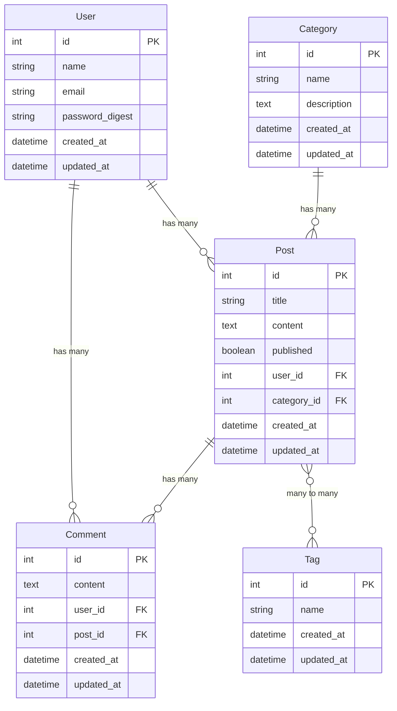

# Blog API

A Rails API application for managing a blog with users, posts, comments, categories, and tags.

## 🔗 GitHub Repository

**Repository Linki:** [https://github.com/godakvolkan/ruby.git](https://github.com/godakvolkan/ruby.git)

## ✨ Features

- **User Management**: Create, read, update, and delete users
- **Post Management**: Full CRUD operations for blog posts
- **Comment System**: Users can comment on posts
- **Category Management**: Organize posts by categories
- **Tag System**: Many-to-many relationship between posts and tags
- **RESTful API**: Clean API endpoints following REST conventions
- **Turkish Sample Data**: Comprehensive Turkish seed data

## 📊 Model İlişkileri Diagramı



## 🏗️ Models and Relationships

### User
- `has_many :posts`
- `has_many :comments`
- Fields: `name`, `email`, `password_digest`

### Post
- `belongs_to :user`
- `belongs_to :category`
- `has_many :comments`
- `has_and_belongs_to_many :tags`
- Fields: `title`, `content`, `published`, `user_id`, `category_id`

### Comment
- `belongs_to :user`
- `belongs_to :post`
- Fields: `content`, `user_id`, `post_id`

### Category
- `has_many :posts`
- Fields: `name`, `description`

### Tag
- `has_and_belongs_to_many :posts`
- Fields: `name`

## API Endpoints

### Users

- `GET /api/v1/users` - List all users
- `GET /api/v1/users/:id` - Show specific user
- `POST /api/v1/users` - Create new user
- `PUT /api/v1/users/:id` - Update user
- `DELETE /api/v1/users/:id` - Delete user

### Posts

- `GET /api/v1/posts` - List all posts
- `GET /api/v1/posts/:id` - Show specific post
- `POST /api/v1/posts` - Create new post
- `PUT /api/v1/posts/:id` - Update post
- `DELETE /api/v1/posts/:id` - Delete post

### Comments

- `GET /api/v1/posts/:post_id/comments` - List comments for a post
- `GET /api/v1/comments/:id` - Show specific comment
- `POST /api/v1/posts/:post_id/comments` - Create new comment
- `PUT /api/v1/comments/:id` - Update comment
- `DELETE /api/v1/comments/:id` - Delete comment

### Categories

- `GET /api/v1/categories` - List all categories
- `GET /api/v1/categories/:id` - Show specific category
- `POST /api/v1/categories` - Create new category
- `PUT /api/v1/categories/:id` - Update category
- `DELETE /api/v1/categories/:id` - Delete category

### Tags

- `GET /api/v1/tags` - List all tags
- `GET /api/v1/tags/:id` - Show specific tag
- `POST /api/v1/tags` - Create new tag
- `PUT /api/v1/tags/:id` - Update tag
- `DELETE /api/v1/tags/:id` - Delete tag

## 🚀 Kurulum Talimatları

### 1. **Ruby ve Rails Kurulumu**

```bash
# Ruby kurulumu (Windows)
# https://rubyinstaller.org/ adresinden indirin

# Rails kurulumu
gem install rails
```

### 2. **Proje Kurulumu**

```bash
# Repository'yi klonlayın
git clone https://github.com/godakvolkan/ruby.git
cd ruby/blog_api

# Bağımlılıkları yükleyin
bundle install
```

### 3. **Veritabanı Kurulumu**

```bash
# Veritabanını oluşturun
rails db:create

# Migration'ları çalıştırın
rails db:migrate

# Örnek verileri yükleyin
rails db:seed
```

### 4. **Sunucuyu Başlatın**

```bash
rails server
```

API `http://localhost:3000` adresinde çalışacaktır.

## 🧪 API Test Örnekleri

### **Hello Endpoint**
```bash
curl -X GET http://localhost:3000/api/v1/hello
```

### **Kullanıcı Oluşturma**
```bash
curl -X POST http://localhost:3000/api/v1/users \
  -H "Content-Type: application/json" \
  -d '{
    "user": {
      "name": "Test Kullanıcı",
      "email": "test@example.com",
      "password": "password123",
      "password_confirmation": "password123"
    }
  }'
```

### **Kategori Oluşturma**
```bash
curl -X POST http://localhost:3000/api/v1/categories \
  -H "Content-Type: application/json" \
  -d '{
    "category": {
      "name": "Test Kategori",
      "description": "Test kategorisi açıklaması"
    }
  }'
```

### **Post Oluşturma**
```bash
curl -X POST http://localhost:3000/api/v1/posts \
  -H "Content-Type: application/json" \
  -d '{
    "post": {
      "title": "Test Post",
      "content": "Bu bir test postudur.",
      "published": true,
      "user_id": 1,
      "category_id": 1,
      "tag_ids": [1, 2]
    }
  }'
```

### **Tüm Postları Listeleme**
```bash
curl -X GET http://localhost:3000/api/v1/posts
```

### **Post Yorumu Oluşturma**
```bash
curl -X POST http://localhost:3000/api/v1/posts/1/comments \
  -H "Content-Type: application/json" \
  -d '{
    "comment": {
      "content": "Harika bir yazı!",
      "user_id": 1
    }
  }'
```

### **Etiket Oluşturma**
```bash
curl -X POST http://localhost:3000/api/v1/tags \
  -H "Content-Type: application/json" \
  -d '{
    "tag": {
      "name": "Test Etiket"
    }
  }'
```

## Database Schema

The application uses PostgreSQL as the database. The migrations create the following tables:

- `users` - User information
- `categories` - Post categories
- `posts` - Blog posts
- `comments` - Post comments
- `tags` - Post tags
- `posts_tags` - Join table for posts and tags (many-to-many relationship)

## CORS Configuration

The API is configured to accept cross-origin requests from any origin. This can be modified in `config/initializers/cors.rb` for production use.

## Error Handling

The API includes proper error handling for:

- Record not found (404)
- Validation errors (422)
- Server errors (500)

All errors are returned in JSON format with appropriate HTTP status codes.
